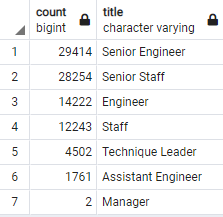

# Pewlett-Hackard-Analysis
## Overview of Project

The purpose of this project was to research impending retirements within the Pewlett-Hackard company. This is to determine who is eligible for retirement benefits. Another analysis was done to possible develop a mentorship program to try and retain some employees in a part-time role to mentor and train other employees thus reducing the retirement benefits that need to be paid out and ensure the roles are adequateley filled.

## Results
### Findings
- There are a total of 90,398 employees that are set to retire any any given time.
- 50% of the retiring employees are engineers (Senior Engineer, Engineer, Assisstant Engineer). The number of the employees are 29,414, 14,222, 1,761 respectively.
- The position with the next highest amount of employees retiring is Senior Staff with 28,254 employees.
- Fortunately, there are only two managers eligible for retirement.
  
  
  
## Summary
### How many roles will need to be filled as the "silver tsunami" begins to make an impact?
As stated earlier there are 90,398 total roles that will need to be filled. The focus needs to be finding those set to retire first and the departments that will be hit hardest. This will allow Pewlett-Hackard to keep ahead of the silver tsunami.

### Are there enough qualified, retirement-ready employees in the departments to mentor the next generation of Pewlett Hackard employees?
There are a total of 1,549 employees eligible to for the mentorship program. There isn't nearly enough enough workers for the program to be effective in getting the next generation ready.

### Two other observations
- Assuming that those born in 1952 will retire first 21,209 employees, 23% of the population will retire first.

- The departments that will be hit hardest by the silver tsunami will be in development.

